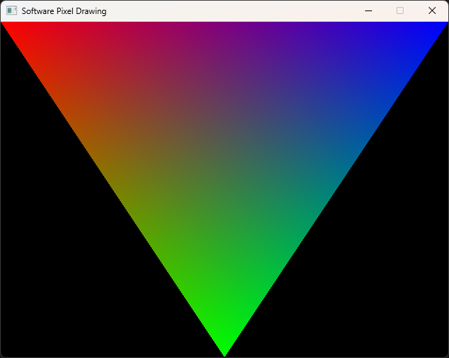

# Bgl

Stateless, zero-dependency software rasterization library for triangles, designed for use with SIMD and multithreading.

Requires **C++20**.
## Features

- Stateless, explicit buffers and configuration
- SIMD-based computation
- Multithreaded Friendly — tile-based rendering with optional locking callbacks for safe parallel writes.
- Arbitrary per-vertex attributes support
- Clip space clipping and viewport transformation

## Basic example (No SIMD, Single thread)

```cpp
struct Color {
    unsigned char red;
    unsigned char green;
    unsigned char blue;
};

void draw_triangle(Color* framebuffer, int width, int height) {
    using namespace bgl;
    
    Viewport viewport(width, height);
   
    constexpr const int TILE_SIZE = 20;
    constexpr bool use_perspective_correction = true;
    constexpr Config<Warp1> config(TILE_SIZE, ClipSpaceStyle::OpenGL, use_perspective_correction);

    constexpr int NUM_ATTRS = 3;

    constexpr int ATTR_RED = 0;
    constexpr int ATTR_GREEN = 1;
    constexpr int ATTR_BLUE = 2;

    float a_attrs[NUM_ATTRS];
    float b_attrs[NUM_ATTRS];
    float c_attrs[NUM_ATTRS];

    a_attrs[ATTR_RED] = 1.f;
    a_attrs[ATTR_GREEN] = 0.f;
    a_attrs[ATTR_BLUE] = 0.f;

    b_attrs[ATTR_RED] = 0.f;
    b_attrs[ATTR_GREEN] = 1.f;
    b_attrs[ATTR_BLUE] = 0.f;

    c_attrs[ATTR_RED] = 0.f;
    c_attrs[ATTR_GREEN] = 0.f;
    c_attrs[ATTR_BLUE] = 1.f;

    const auto shader = [&](int tx, int ty, int column, int row, int mask, float* attrs) {
        int index = (tx * TILE_SIZE + column) + (ty * TILE_SIZE + row) * width;

        Color color;
        color.red = attrs[ATTR_RED] * 255;
        color.green = attrs[ATTR_GREEN] * 255;
        color.blue = attrs[ATTR_BLUE] * 255;

        framebuffer[index] = mask ? color : framebuffer[index];
    };

    //homogeneous coordinates
    clip_space_triangle<config>(
        viewport,
        -1.0f, -1.0f, 0.5f, 1.0f,
        0.0f, 1.0f, 0.5f, 1.0f,
        1.0f, -1.0f, 0.5f, 1.0f,
        a_attrs,
        b_attrs,
        c_attrs,
        shader,
        [](int tx, int ty){}, //tile_lock
        [](int tx, int ty){} //tile_unlock
    );
}
```

## Details & Usage

### Overview

Vertices are expected in **clip space** (x, y, z, w), i.e., coordinates after projection.  
Each vertex may have additional attributes (UVs, color, depth, etc.). The library interpolates these attributes across the triangle.  
Rasterization is **tile-based** and can be multithreaded. A user-provided `fragment` callback is called for each active pixels.

**Important:** The library does **not** write to any buffers. Depth, color, or other outputs must be managed manually in the `fragment` callback. Optional `tile_lock` and `tile_unlock` callbacks allow safe writes in multithreaded contexts.

### Warp

`Warp` is a class provided in the `Config` template that defines the **SIMD backend** for rasterization.

A typical `Warp` class should implement the necessary SIMD types and operations. Interface and example:

```cpp
#include <xsimd/xsimd.hpp>

struct Warp {

    using arch = xsimd::avx2;

    using Int = xsimd::batch<int, arch>;
    using IntMask = xsimd::batch_bool<int, arch>;
    using FloatMask = xsimd::batch_bool<float, arch>;
    using Float = xsimd::batch<float, arch>;

    constexpr static inline int SIZE = Int::size;
    constexpr static inline int ALIGNMENT = SIZE * 4;

    inline static Float scalar(float v) { return Float(v); }
    inline static Float load(float* src) { return Float::load_aligned(src); }
    inline static Float fma(Float a, Float b, Float c) { return xsimd::fma(a, b, c); }
    inline static Float mul(Float a, Float b) { return a * b; }
    inline static Float div(Float a, Float b) { return a / b; }
    inline static Float add(Float a, Float b) { return a + b; }
    inline static Float reciprocal(Float a) { return xsimd::reciprocal(a); }

    inline static Int scalar(int v) { return Int(v); }
    inline static Int load(int* v) { return Int::load_aligned(v); }
    inline static Int mul(Int a, Int b) { return a * b; }
    inline static Int add(Int a, Int b) { return a + b; }

    inline static IntMask and_(IntMask a, IntMask b) { return a && b; }
    inline static IntMask greater(Int a, Int b) { return a > b; }
};
```
### Attributes

Each vertex can have **additional attributes** (UV coordinates, color, depth, etc.) specified as an array.  
These attributes are interpolated across the triangle using either affine or perspective-correct interpolation, depending on the configuration.  

### Shading

Shading in this library is fully **user-controlled** via the `fragment` callback.

The `fragment` callback receives:

- `tx`, `ty` — tile coordinates  
- `column`, `row` — pixel coordinates within the tile  
- `Warp::IntMask mask` — mask indicating which pixels are active  
- `Warp::Float* attrs` — interpolated vertex attributes for active pixels

If `perspective_correction` is enabled, an **additional implicit `1/w` attribute** is appended at the end of `attrs` for perspective-correct interpolation.

The callback processes **N pixels at once**, where N is the SIMD width defined by the `Warp` type.

Example:

```cpp
[](int tx, int ty, int column, int row, Warp1::IntMask mask, Warp1::Float* attrs){
    // Perform shading and write color/depth manually
    if(mask) {
        framebuffer[tx*tile_size + column + (ty*tile_size + row)*screen_width] = computeColor(attrs);
    }
}
```
### Multithreading

The library supports **tile-based multithreaded rasterization**. Each triangle is processed in tiles, and optional `tile_lock` and `tile_unlock` callbacks allow safe access to shared buffers.  

Since the library is **stateless**, multiple threads can rasterize different triangles concurrently without interference. Users are responsible for managing writes to color, depth, or other buffers within the `fragment` callback.  

For synchronization, a simple **spinlock** or other lightweight locking mechanism can be used inside the `tile_lock`/`tile_unlock` callbacks to protect shared resources without significant overhead.
